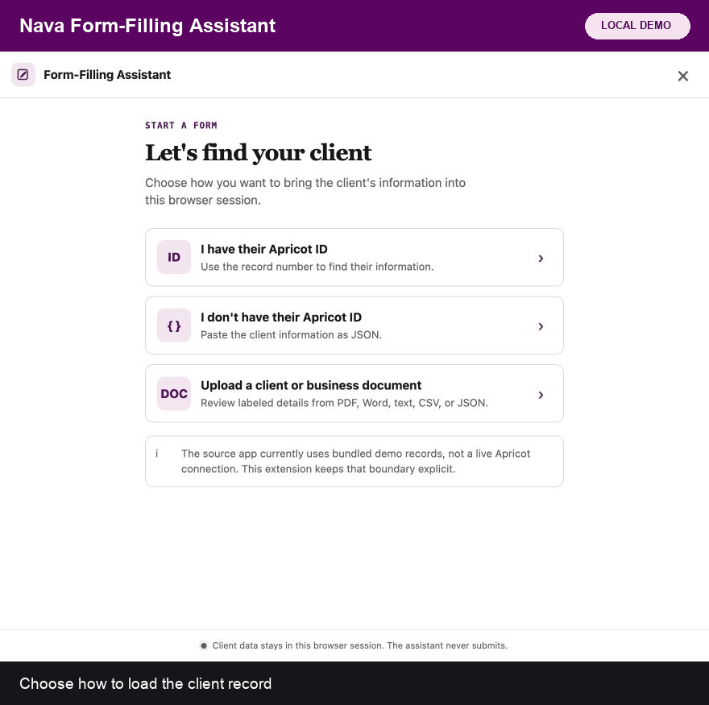

# Nava Form-Filling Assistant — Chrome prototype



This is a loadable Manifest V3 Chrome extension that adapts Foad's `form-completion` skill to Jillian's side-panel design.

It is a working local prototype, not a production deployment. It can connect to a read-only organization data service, map labeled source fields, import a client or business document, inspect an application, ask for missing answers, fill and verify approved multi-page flows, and show one provenance review. It has no submit command.

> **Evidence boundary:** the current build autonomously completed a six-page local benefits fixture through final review with 28 of 28 source-backed fields verified. It has not been connected to a production Apricot tenant or completed a live BenefitsCal application in a sanctioned test environment. Use only fictional or approved test data. See [production-readiness evidence](docs/PRODUCTION_READINESS.md).

## What is implemented

- Jillian's main flow: find client → choose applications → dashboard → answer questions → review.
- Local document intake for PDF, PNG, JPEG, WebP, DOCX, TXT, CSV, TSV, and JSON files up to 15 MB.
- Deterministic extraction of clearly labeled demographic, identity, contact, address, and business fields, plus bounded on-device English OCR for images and image-only PDF pages. No model or network call is used.
- Page, region, OCR-confidence, and rotation provenance for every OCR proposal. OCR values always start unchecked and require explicit review before import.
- A reproducible synthetic extraction corpus covering clean scans, low contrast, rotation, tables, bilingual labels, and unsupported handwriting. The current quality gate passes at 100% precision, 91.2% recall, 100% expected-abstention accuracy, zero accepted wrong values, and zero sensitive evidence leaks.
- Field-by-field intake review. New and matching values start selected; conflicts start unselected and require an explicit replacement choice.
- SSNs and EINs are masked in intake evidence and later review screens.
- A provider-neutral managed-connector flow: searchable source catalog, health check, labeled-schema discovery, suggested mappings, admin review, record lookup, field-level provenance, stale-record warnings, and caseworker confirmation before import. The included runnable adapter is a fictional Apricot-shaped loopback fixture; other catalog entries require production server adapters.
- A hard credential boundary. Chrome accepts only an organization label, HTTPS service URL, opaque connection ID, form ID, reviewed mappings, and freshness policy. Provider secrets stay server-side.
- One session-only client record shared across application tabs.
- One writer per tab. Each application is tracked independently.
- Guided multi-page completion for approved site playbooks. The runner keeps the client record loaded, fills each page, reads every write back, and activates only exact safe continuation labels such as **Begin**, **Next**, or **Save and continue**.
- Cross-page progress history, loop detection, a 12-page safety ceiling, and automatic pauses when a field needs direct help.
- A durable multi-application work queue with stable workflow IDs, explicit checkpoints, tab-closure recovery, and restart-safe progress metadata.
- Verified resume: the assistant rescans the live tab and compares its URL and page signature before it permits another write.
- Caseworker/team ownership, pending and accepted handoffs, and a short per-application lease that prevents two assistant windows from writing to the same workflow at once.
- A value-free activity log for scan, fill, verification, safe navigation, pause, resume, handoff, review, and tab-closure events. Caseworkers can export it as JSON.
- A hard final-action boundary: certification, attestation, signature, Finish, Complete, Apply, and Submit controls are never activated.
- Live field inventory using labels, ARIA text, autocomplete, field types, required markers, options, masks, and maxlength.
- Gap categories from the skill: record values, changed values, missing values, decisions, and values with no place on the current page.
- Explicit no-inference rules for SSN, housing status, contact preference, household size, immigration status, income, childcare, and unemployment.
- Batched gap questions before the first write.
- Idempotent checkbox/radio writes, exact option matching, top-to-bottom writes, native value events, an incremental masked-field fallback, and readback verification.
- Diagnosis for hidden, disabled, masked, changed, and maxlength-constrained fields.
- Bundled knowledge signals for BenefitsCal, Riverside IHSS, and Riverside WIC.
- Submit-gate and bot-token inspection. The extension reports the state but cannot click submit.
- Session-only participant storage (`chrome.storage.session`). The raw uploaded document is not stored. Non-personal connector configuration and labeled schema use `chrome.storage.local`; managed lookups use the configured organization service.
- A regular-page preview mode and a local form fixture for safe testing.

## Load it in Chrome

1. Open `chrome://extensions`.
2. Turn on **Developer mode**.
3. Choose **Load unpacked**.
4. Select this `nava-form-filling-assistant-chrome-extension` folder.
5. Open a web form and click the extension icon. Chrome opens the assistant in the side panel.

Chrome may require an already-open form tab to be refreshed once after the extension is first loaded.

## Safe local demo

From this folder, serve the project:

```bash
python3 -m http.server 4173
```

Then open `http://localhost:4173/demo/demo-form.html`, open the extension, and use demo client ID `339619`. The demo's submit button never sends anything.

The automated three-page DOM fixture runs at:

```text
http://localhost:4173/demo/multi-page.html?step=1&autorun=1
```

The extensive six-page, 28-field validation flow runs at:

```text
http://localhost:4173/demo/extensive-application.html?step=1&autorun=1&reset=1
```

To preview only the side-panel UI without loading the extension, serve the extension root and open:

```text
http://localhost:4173/sidepanel/index.html?preview=1&demo=1
```

## Self-service connector demo

The repository includes a provider-neutral extension contract and a loopback-only connector service with fictional Apricot-shaped data. It never accepts provider credentials. The catalog also names Salesforce Nonprofit, Bitfocus Clarity, WellSky Community Services, Eccovia ClientTrack, CaseWorthy, Foothold AWARDS, and Bonterra ETO, but those entries require authorized server adapters before they can connect.

```bash
npm run connector:mock
```

In the extension, select **Connect**, then configure:

```text
Organization: Riverside Community Services
Service URL: http://127.0.0.1:4789
Connection ID: nava-demo
Provider: Bonterra Apricot 360
Form / resource key: 99
```

Test the connection, review the label-based mapping, save it, retrieve fictional record `339619`, and confirm the mapped record preview. For a regular-page UI walkthrough, open `http://localhost:4173/sidepanel/index.html?preview=1`; **Use local demo settings** supplies those values.

The production service contract and required security controls are documented in [`connector-service/README.md`](connector-service/README.md). The [connector coverage matrix](docs/CONNECTOR_COVERAGE.md) explains why this is not yet a Plaid-like production network.

## Checks

```bash
npm run check
npm test
npm run eval:extraction
```

## Document intake behavior

Select **Upload a client or business document** from the first screen, or **Add document** beside an already loaded record. The extension parses the file on-device and shows each proposed value, confidence level, and a short source snippet before merging it.

PDF text extraction uses the bundled PDF.js worker. Pages without usable embedded text, as well as PNG, JPEG, and WebP images, use the bundled Tesseract.js runtime and pinned English `tessdata_fast` model. DOCX extraction reads the document XML with bundled fflate. Text and delimited files use the same strict labeled-field rules. Nothing is sent to an OCR service.

OCR is capped at 8 pages, 8 million pixels per attempt, 32 million total processed pixels, 10 attempts, a 30-second startup timeout, and 45 seconds per page. It retries 90°/270° rotation only for weak first passes. Candidates below the base 70% confidence floor are withheld; email and sensitive identifiers require stricter confidence, and common name artifacts are rejected. Every accepted OCR proposal still starts unchecked. Password-protected files, HEIC, legacy `.doc`, handwriting extraction, and languages other than English are outside this build.

Run `npm run eval:extraction` to reproduce the published [quality report](evaluation/latest-report.md). See [OCR security and limits](docs/OCR_SECURITY_AND_LIMITS.md) for the threat model, resource budgets, abstention policy, and pilot work still required. See [`THIRD_PARTY_NOTICES.md`](THIRD_PARTY_NOTICES.md) for licenses.

## Resumable work queues and handoff

Version 0.7 retains the version 0.6 privacy boundary between short-lived client values and durable operational state:

- Participant values, document proposals, raw page signatures, and full page URLs remain in `chrome.storage.session` and expire with the browser session.
- `chrome.storage.local` retains only sanitized queue metadata: workflow ID, application label, origin, status, progress counts, checkpoint, owner/handoff state, tab ID, timestamps, and opaque checksums of the saved path and page signature.
- Closing a tab creates a recoverable checkpoint. Restarting Chrome preserves the queue, but the assistant requires the caseworker to reload the authorized source record before resuming because participant values were intentionally not retained.
- Resume always performs a read-only live scan first. A changed location, changed page signature, stale source, expired source, unaccepted handoff, or missing tab blocks writes.
- CAPTCHA, one-time codes, direct-entry fields, certification, signature, and final review are named checkpoints rather than background automation steps.

The current handoff is a same-Chrome-profile workflow and ownership prototype. It does not transmit client data or synchronize queues between caseworkers. A production cross-device handoff requires an authenticated organization service with authorization, encrypted storage, retention controls, and concurrency enforcement. See [work-queue security and recovery](docs/WORK_QUEUE_SECURITY_AND_RECOVERY.md).

## Production integration boundary

Version 0.7 implements the extension half of a provider-neutral managed connector, bounded local OCR, an extraction-quality gate, an extensive synthetic benefits-flow test, and a resumable metadata-only work queue. It ships a fictional loopback connector service for contract testing, not a production credential broker, organization-authentication service, provider network, or cross-device queue backend.

- `background.js` uses credentialed, read-only `GET` requests to the configured Nava connector service. It does not call Apricot directly.
- `shared/connector-engine.js` accepts only labeled schema fields, rejects secret-like configuration, requires HTTPS outside localhost, and will not infer meaning from an opaque source field ID.
- Chrome stores the sanitized connection descriptor, reviewed mapping, and labeled schema—not Apricot credentials or participant records. Retrieved participant data remains session-only.
- The production service must authenticate the current organization, keep provider credentials in a secret manager, enforce least-privilege read scopes, restrict CORS to the managed extension ID, support revocation, and avoid logging record bodies.
- The managed build should narrow `host_permissions` to approved application and connector domains.

The browser extension also cannot produce genuinely trusted hardware keystrokes. Its incremental mask fallback works with many event-driven controls, but a site that rejects all synthetic events is marked for direct caseworker entry. Adding Chrome's debugger permission solely to force trusted keystrokes would create an invasive permission and is intentionally out of scope.

## Current limits

- Automatic continuation is deliberately allowlisted. Unknown sites and ambiguous controls pause for the caseworker instead of navigating.
- Human checkpoints—including CAPTCHA, one-time codes, certifications, signatures, and the final submission—always pause the run.
- It scans the top document, not cross-origin frames or closed shadow roots.
- Playbook signals identify known sites and known freshness fields; the live DOM scan remains authoritative for every write.
- Opening known applications is implemented. Background parallel autonomous agents are not: local Chrome tabs share a human browser and extension service worker, so this build enforces one writer per tab instead.
- Handoff metadata is local to one Chrome profile. It demonstrates the ownership and acceptance flow but is not an authenticated cross-device assignment system.
- The included connector server is a fictional loopback fixture. A real organization still needs the Nava-controlled service, provider partnership/access, authentication, security review, and data-processing controls.
- Provider selection is not the same as a live connection. Only the fictional Apricot-shaped adapter is runnable in this repository; all other listed systems require authorized backend adapters and sandbox validation.
- There is no model call. Ambiguous, unlabeled, low-confidence, and unsupported OCR content is withheld or remains untouched.

## Evidence, costs, and next steps

- [Production-readiness evidence](docs/PRODUCTION_READINESS.md) states exactly what is and is not validated.
- [Connector coverage](docs/CONNECTOR_COVERAGE.md) covers the current catalog, major human-services systems, and the work needed for a Plaid-like experience.
- [Application cost model](docs/COST_MODEL.md) separates the prototype's $0 marginal third-party usage cost from a realistic production calculation.

See [`docs/IMPLEMENTATION_NOTES.md`](docs/IMPLEMENTATION_NOTES.md) for the exact mapping from the six-phase skill to the extension architecture.

See [`docs/TEST_REPORT.md`](docs/TEST_REPORT.md) for the connector walkthrough, controlled multi-page results, and read-only BenefitsCal compatibility check. The updated next product investment is in [`docs/ROADMAP.md`](docs/ROADMAP.md).
